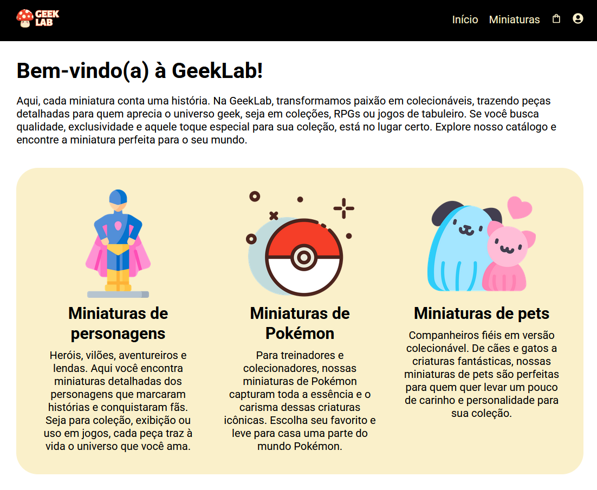
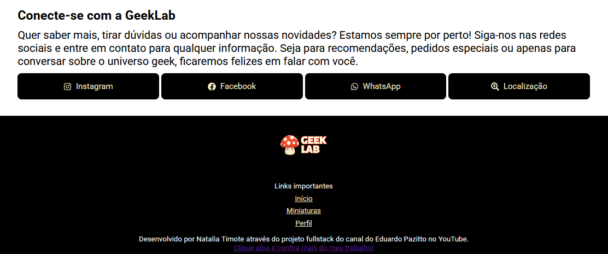
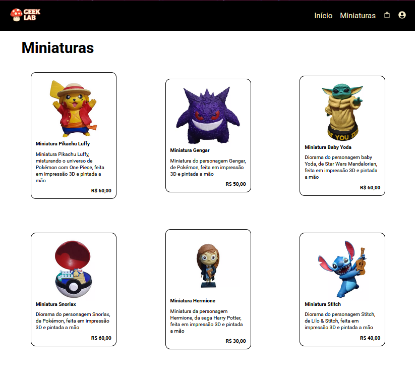
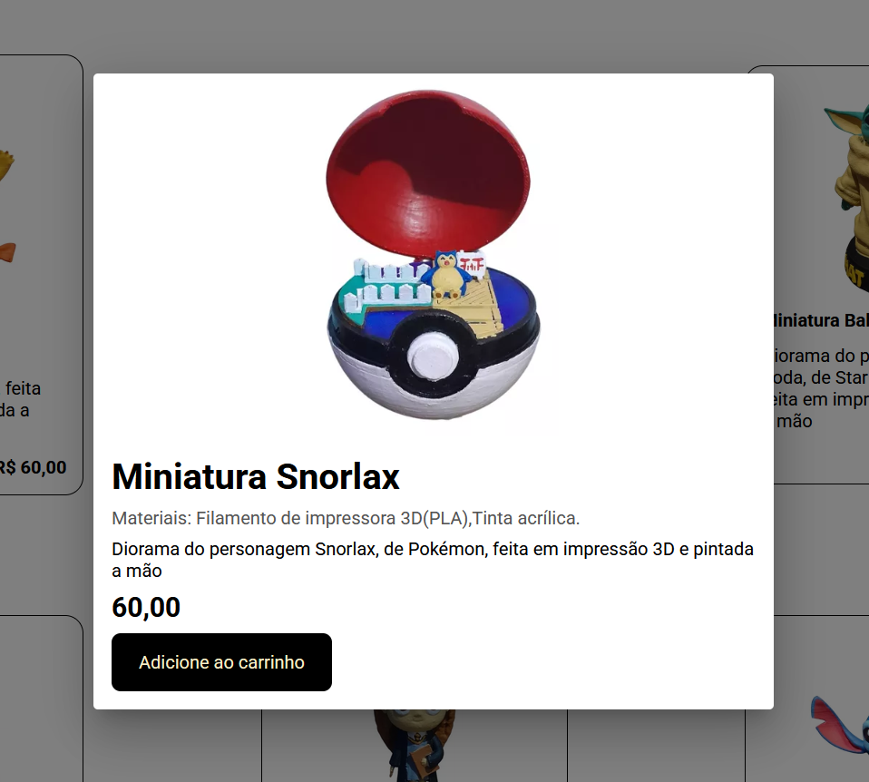
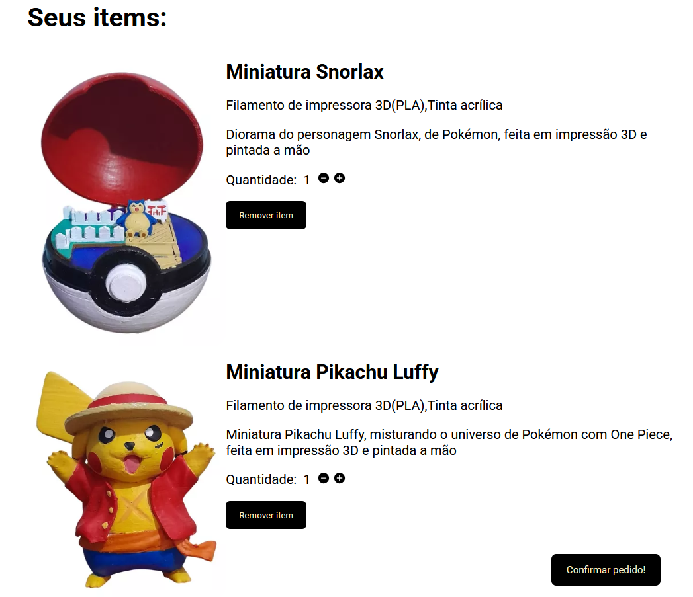
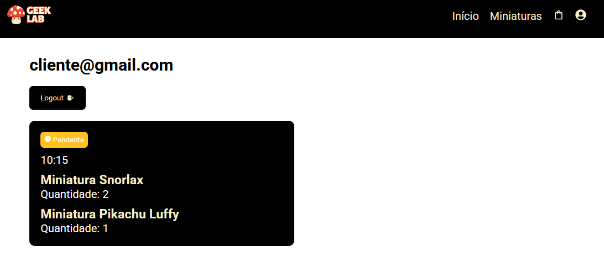
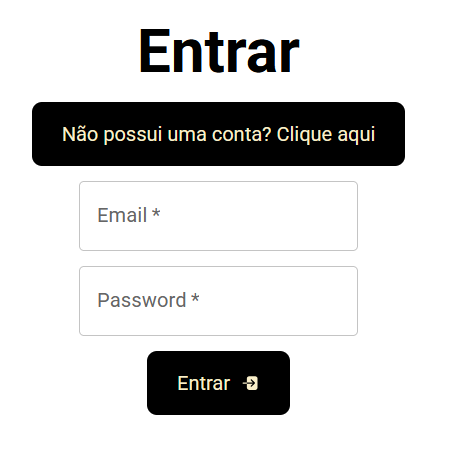
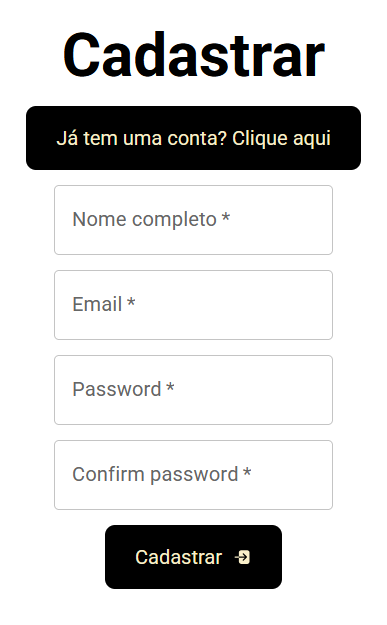

## 🍄 GeekLab

A **GeekLab** é uma aplicação **fullstack** desenvolvida com **React, Node.js e MongoDB**, com o objetivo de gerenciar produtos de forma prática e organizada. Esta versão foi adaptada para a venda de **miniaturas 3D pintadas à mão**, personalizando o projeto apresentado nos vídeos do **Eduardo Pazitto no YouTube**.

## 🚀 Sobre o Projeto

A aplicação GeekLab foi criada a partir de uma série de vídeos do YouTube:

* "Aprenda a programar do zero (React, Node, MongoDB)" - Eduardo Pazitto
  
O projeto permite gerenciar produtos de forma completa, simulando um ambiente real de e-commerce. O foco principal foi entender a **integração entre front-end e back-end**, trabalhar com **banco de dados MongoDB** e explorar **boas práticas em React e Node.js**.

## 📚 Objetivos do Projeto

* Aprender a criar um projeto **fullstack** utilizando **React, Node.js e MongoDB**;
* Compreender a arquitetura de uma aplicação completa, incluindo **front-end, back-end e banco de dados**;
* Gerenciar produtos de forma organizada e dinâmica;
* Integrar **APIs RESTful** para comunicação entre front-end e back-end;
* Aplicar conceitos de **CRUD** e **persistência de dados em MongoDB**;
* Criar uma aplicação prática baseada em experiência real de vendas.

## 🛠️ Tecnologias Utilizadas

   

## 🖼️ Visualização do Projeto

Uma prévia das principais funcionalidades da **GeekLab**:

**🛍️ Página Inicial**

Página principal com destaque para os produtos disponíveis e menu de navegação.

**🌐 Informações de Contato e Rodapé**

Seção dedicada a informações de contato da loja e links úteis.

**📦 Produtos Disponíveis**

Seção que exibe todas as miniaturas 3D, com imagens, nomes e valores.

**🎨 Detalhes do Produto**

Ao clicar em um produto, o usuário visualiza detalhes e pode adicionar o item ao carrinho.

**🛒 Itens no Carrinho**

Área que exibe os produtos adicionados ao carrinho, mostrando imagem, nome, quantidade e valor unitário.

**🧑‍💻 Pedidos do Usuário**

Seção onde o usuário pode acompanhar os pedidos realizados, com informações sobre cada compra, status e datas.

**🔑 Login**

Página para autenticação do usuário, permitindo acesso ao perfil, histórico de pedidos e funcionalidades do site.

**📝 Cadastro**

Formulário para criação de conta, incluindo campos para nome, e-mail, senha e confirmação de senha, permitindo ao usuário acessar a loja e realizar compras.

